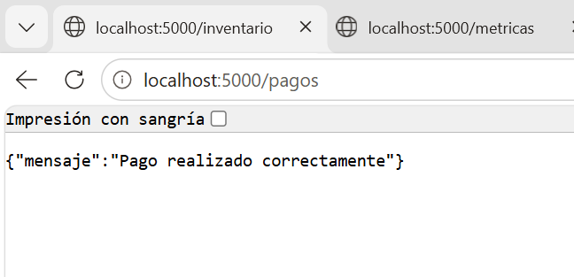
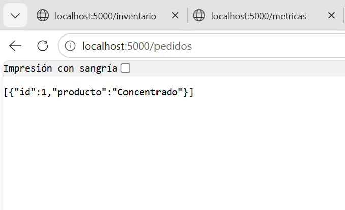
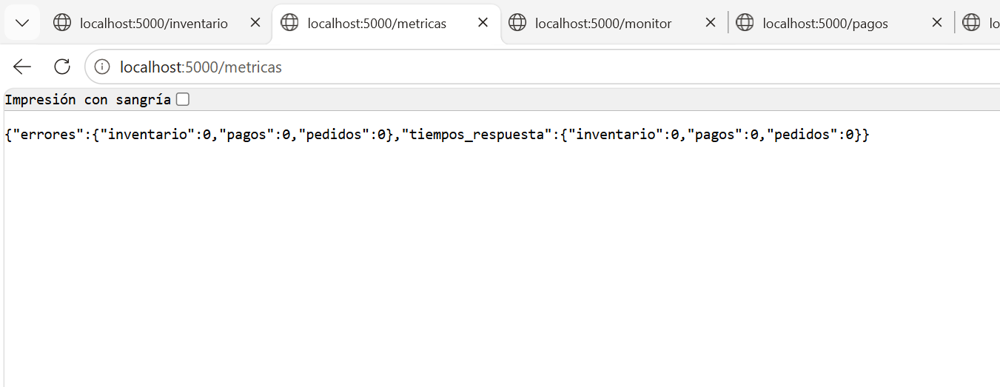
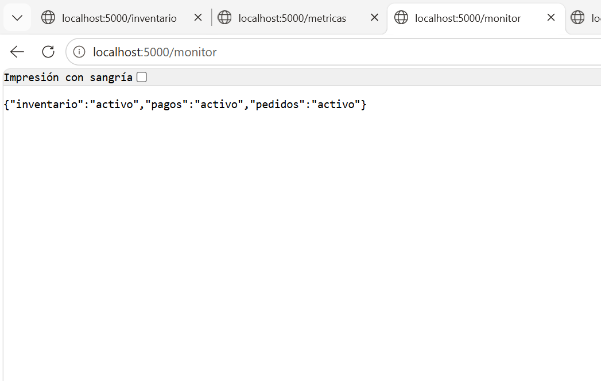
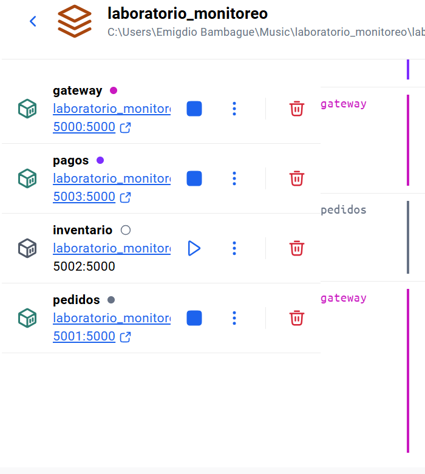
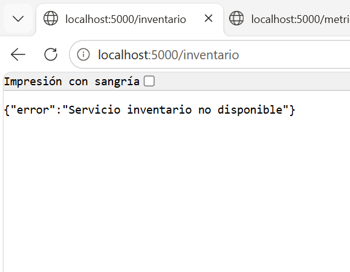
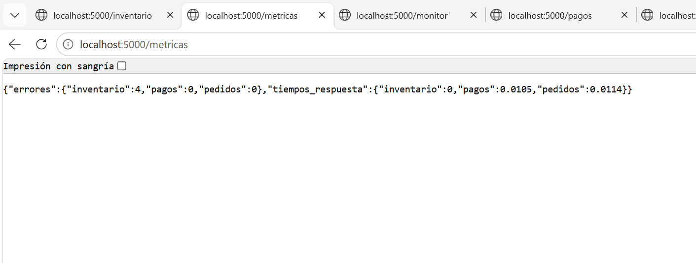
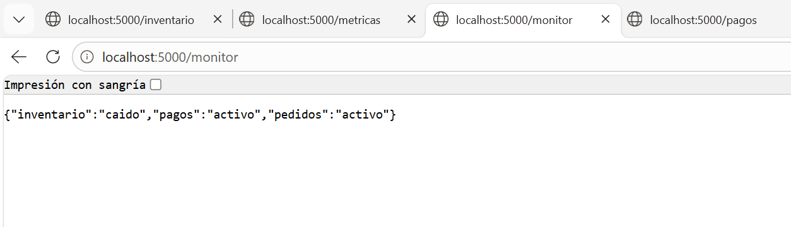
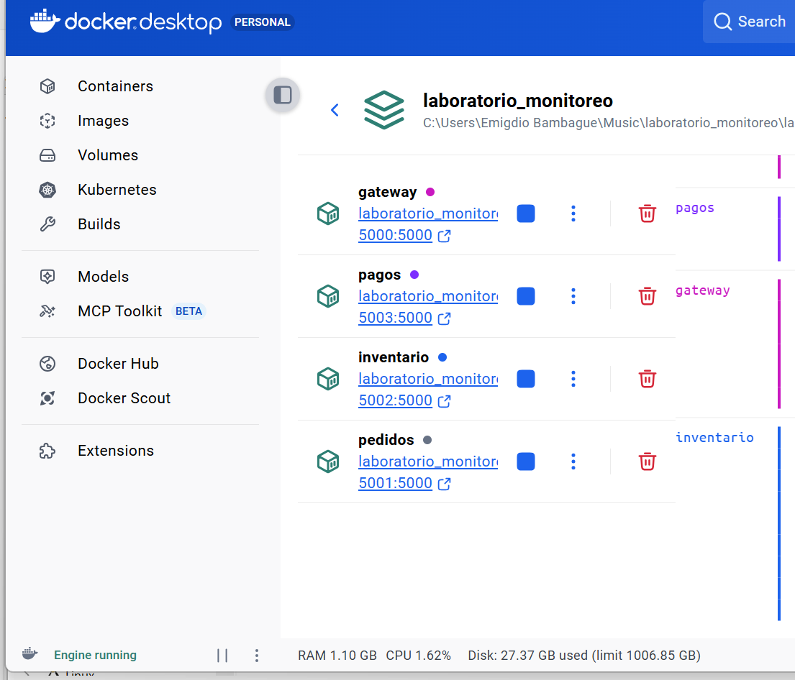
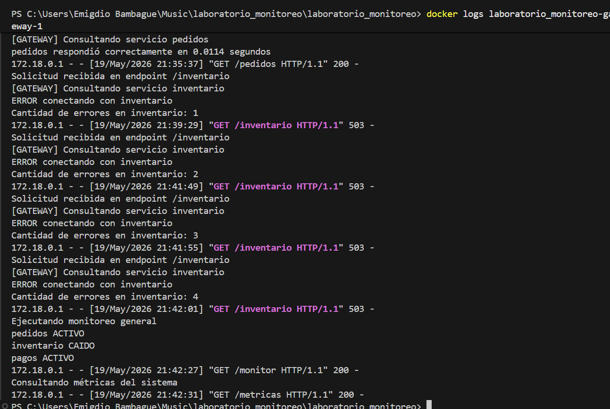

INTRODUCION

Este proyecto implementa una arquitectura basada en microservicios utilizando Flask y Docker. Su objetivo principal es demostrar el monitoreo, la medición de métricas y la tolerancia a fallos mediante un Gateway central.

DESCRIPCION DEL SISTEMA

El sistema está compuesto por los siguientes microservicios:

Pedidos
Inventario
Pagos
Gateway (API Gateway)

El Gateway actúa como intermediario entre el cliente y los servicios, gestionando solicitudes, registrando métricas y controlando errores.

ARQUITECTURA

Cliente → Gateway → Microservicios-Pedidos-Inventario-Pagos
                  

-Cada servicio corre en un contenedor Docker
-Comunicación mediante APIs REST
-Monitoreo centralizado en el Gateway

TECNOLOGIAS UTILIZADAS

-Python
-Flask
-Docker
-Docker Compose
-REST APIs

¡[Descripción](imagenes_pedidos/1.png)

